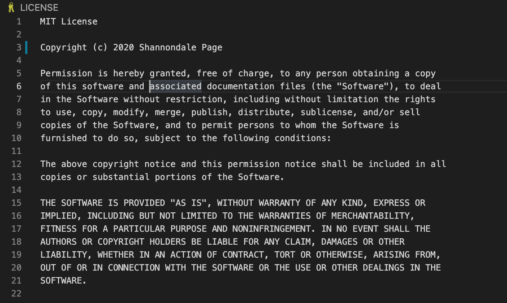

# Creative README

## Table of contents:

* Project Description
* Summary
* License
* Demo Content
* Special Features
*Install
*Usage
*License
*Tests
*Contributions
*Questions
*Author(s)

## Project Description

* What is your project's description? **  To generate a dynamic README file using node.js.**

## Summary

* This project applies Javascript, Nodes.js applications. With the use of Javascript and Node.js, the user has the ability submit information to supplement the creative document dynamically.

## License

* What kind of license should your project have? MIT

## Demo Content

<a href="https://github.com/sjohn214/ReadMeCreator.git">README Creator GitHub Repo</a>

## Special Features

## Installation

* What command should be used to install dependencies? User must install npm i, node.js

## Usage

* How do you use this application? User must run npm i, node index.js on command line in terminal
* What does the user need to know about using the repo?   This repo was created dynamically using javascript and node.js by calling the inquirer, init, and writetoFile functions.

## Tests

* What command should be run to test the application? User must run nmp test

## Contributions

* What does the user need to know about contributing to the repo?   Submit a pull request to view possible changes to repo.

## Questions

* Do you have questions or would you like to comment? 
* What is your github username? **  shanban07**
* What is your email address?   s5328j@gmail.com
* Please provide the best contact method. 980-636-9291
 
## Authors
* Shannondale Page (student) <a href="https://github.com/sjohn214">Git Hub Profile</a>
* Austin Bruch (Bootcamp Instructor)
* Jon Jackson (Bootcamp TA Instructor)
* Daniel Sires (Bootcamp Tutor)

  